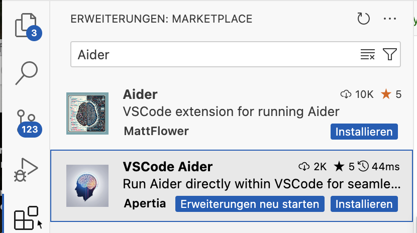
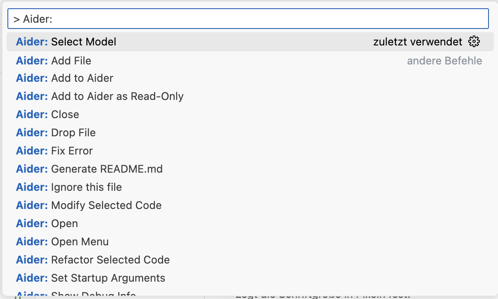

# Howto install aider as VSCode extension with local running ollama

## Run ollama
Please visit to the official ollama docs and find out, how to run ollama models on your local System.
[](https://ollama.com/)

After you successfully installed ollama, download once and run the model with
```console
ollama run deepseek-coder-v2
```

## Download VSCode Aider extension
Start vscode and open the extension marketplace and type 'Aider' in the search box


Tipp: Maybe you should restart VSCode... 😇

## Configure Ollama Model
Open a Terminal in VSCode and enter
Linux/Mac
```console
export OLLAMA_API_BASE=http://127.0.0.1:11434>
```

Windows (not tested, restart shell after setx)
```console
setx   OLLAMA_API_BASE http://127.0.0.1:11434
```
<ol>
<li>Start Aider: 🏁 Fire up the command palette (Ctrl+Shift+P) and search for "Aider: Open".</li>
<li>Select AI Model: 🤖 Pick your AI companion with the "Aider: Select Model" command.</li>
<li>Add Custom Model

<li>Give the model a name: 'deepseek-coder-v2'</li>
<li>Type in the model run command: '--model ollama/deepseek-coder-v2 --no-show-model-warnings'</li>
<li>Access Menu: 📊 Click the Aider status bar item or use the command palette for all Aider functions.</li>
<li>Refactor/Modify Code: ✨ Select code, right-click, and let Aider work its magic.</li>
<li>Manage Files: 📁 Use the explorer context menu to add or ignore files in Aider.</li>
<li>Generate README: 📝 Create a stunning project README with "Aider: Generate README.md".</li>
</ol>
