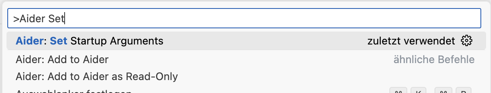

# Howto install aider as VSCode extension with local running ollama

## Run ollama
Please visit to the official ollama docs and find out, how to run ollama models on your local System.
[](https://ollama.com/)

After you successfully installed ollama, download once and run the model with
```console
ollama run deepseek-coder-v2
```

## Download VSCode Aider extension
Start vscode and open the extension marketplace and type 'Aider' in the search box


## Configure Ollama Model
Put this line in you .*rc file (.bashrc, .zshrc,....) and start a new 
Linux/Mac
```console
export OLLAMA_API_BASE=http://127.0.0.1:11434>
```

Some to Windows (TODO: not tested, and don't know the filename to put in...)
```console
setx   OLLAMA_API_BASE http://127.0.0.1:11434
```

Tipp: Restart VSCode... 😇

<ol>
<li>Select AI Model: 🤖 Fire up the command palette (Ctrl+Shift+P) and search for "Aider: Select Model" command.</li>
<li>Add Custom Model: 

    <ol>
        <li>Give the model a name: 'deepseek-coder-v2'</li>
        <li>Type in the model run command: '--model ollama/deepseek-coder-v2'</li>
    </ol>
<li>(Optional) Set Startup Params: ⚙️ Fire up the command palette (Ctrl+Shift+P) and search for "Aider: Set Startup Params"

    <ol><li>Type in: '--no-show-model-warnings' to let aider ignore warnings about the local ollama model
    </li></ol>
<li>Start Aider: 🏁 Fire up the command palette (Ctrl+Shift+P) and search for "Aider: Open".</li>
<li>Access Menu: 📊 Click the Aider status bar item or use the command palette for all Aider functions.</li>
<li>Refactor/Modify Code: ✨ Select code, right-click, and let Aider work its magic.</li>
<li>Manage Files: 📁 Use the explorer context menu to add or ignore files in Aider.</li>
<li>Generate README: 📝 Create a stunning project README with "Aider: Generate README.md".</li>
</ol>

## Tipps
* add the following line to your .gitignore file in the projectyou are working with aider (if you have one, otherwise i woukd suggest to create one, aider will also suggest it to do so on startup ;)
#### **`.gitignore`**
```console
.aider*
```
